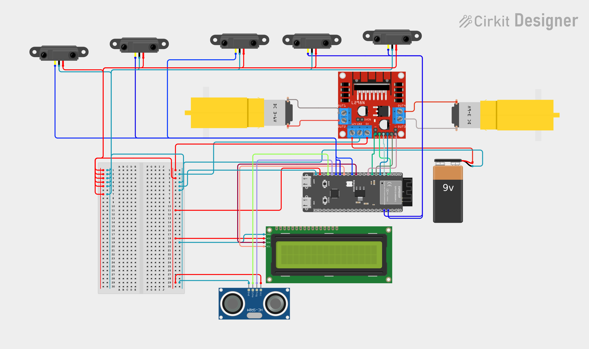

<div align="center">

# 🤖 Indoor Food Delivery Robot

### Autonomous Line-Following Food Delivery System with Obstacle Detection

<p>
  
  
  
  
  
</p>

<p>
  <strong>
    A compact autonomous mobile robot designed to transport food along a predefined
    indoor path while detecting obstacles and providing real-time system feedback.
  </strong>
</p>

<p>
  <a href="#-overview">Overview</a> •
  <a href="#-features">Features</a> •
  <a href="#-system-architecture">Architecture</a> •
  <a href="#-3d-model">3D Model</a> •
  <a href="#-hardware-implementation">Hardware</a> •
  <a href="#-software--control">Software</a> •
  <a href="#-team">Team</a>
</p>

</div>

---

## 📸 Project Preview


---

## 📌 Overview

The **Indoor Food Delivery Robot** is an embedded robotics project developed to demonstrate autonomous food transportation in an indoor environment.

The robot follows a predefined line using **five IR sensors**, detects obstacles using an **HC-SR04 ultrasonic sensor**, controls its drive motors through an **L298N motor driver**, and provides real-time status information through a **16×2 I2C LCD**.

An **ESP32-S3** acts as the main controller and continuously processes sensor information to determine whether the robot should move forward, correct its direction, turn, stop for an obstacle, or stop at a destination/junction.

The project combines:

> **Embedded Systems + Robotics + Sensor Integration + Motor Control + Autonomous Navigation + Mechanical Design**

---

## ✨ Features

- 🛣️ **5-sensor line following**
- 🚧 **Ultrasonic obstacle detection**
- 🛑 **Automatic obstacle safety stop**
- ↩️ **Left and right path correction**
- 🔄 **Sharp-turn handling**
- 🎯 **Destination / junction detection**
- 📟 **16×2 I2C LCD status display**
- 🖥️ **Serial Monitor diagnostics**
- ⚙️ **PWM motor speed control**
- 🍱 **Dedicated food delivery tray**
- 🧩 **ESP32-S3 based control system**
- 🛠️ Designed with both **3D modeling and physical hardware implementation**

---

## 🧠 Project Concept

The basic idea is simple:

```text
        FOOD / ORDER
             │
             ▼
      ┌──────────────┐
      │ Delivery Tray│
      └──────┬───────┘
             │
             ▼
   ┌─────────────────────┐
   │   Food Delivery     │
   │       Robot         │
   └──────────┬──────────┘
              │
              ▼
      Follow Indoor Path
              │
              ▼
       Detect Obstacles
              │
              ▼
      Reach Destination
              │
              ▼
        Deliver Food
```

The robot is intended to move autonomously along a marked route instead of requiring continuous manual control.

---

## ⚙️ How It Works

The robot operates through a continuous sensor-processing-control loop.

### 1. Path Detection

Five IR sensors are positioned at the front of the robot:

```text
Far Left     Left     Center     Right     Far Right
   │           │         │          │           │
   ▼           ▼         ▼          ▼           ▼
 [ IR ]      [ IR ]    [ IR ]     [ IR ]      [ IR ]
```

The sensor pattern tells the controller how the robot is positioned relative to the line.

### 2. Direction Control

Based on the IR sensor readings:

- Center aligned → move forward
- Left deviation → correct left
- Right deviation → correct right
- Sharp left pattern → turn left
- Sharp right pattern → turn right
- No valid line → stop/search
- Destination pattern → stop

### 3. Obstacle Detection

The HC-SR04 continuously checks the distance in front of the robot.

The current software uses:

```cpp
const int SAFE_DISTANCE = 15; // cm
```

If an obstacle is detected at **15 cm or closer**, the robot stops.

### 4. Motor Control

The ESP32-S3 sends control signals to the **L298N motor driver**, which drives the DC motors.

### 5. Status Feedback

The 16×2 I2C LCD displays the robot's current condition, while the Serial Monitor provides detailed diagnostic information.

---

## 🏗️ System Architecture

```text
                         ┌──────────────────────┐
                         │       ESP32-S3       │
                         │   Main Controller    │
                         └──────────┬───────────┘
                                    │
              ┌─────────────────────┼─────────────────────┐
              │                     │                     │
              ▼                     ▼                     ▼
       ┌──────────────┐      ┌──────────────┐      ┌──────────────┐
       │  5× IR       │      │   HC-SR04    │      │   16×2 LCD   │
       │ Line Sensors │      │  Ultrasonic  │      │   I2C        │
       └──────┬───────┘      └──────┬───────┘      └──────────────┘
              │                     │
              └──────────────┬──────┘
                             ▼
                   ┌──────────────────┐
                   │ Decision & Logic │
                   └────────┬─────────┘
                            ▼
                   ┌──────────────────┐
                   │      L298N       │
                   │   Motor Driver   │
                   └────────┬─────────┘
                            ▼
                    ┌──────────────┐
                    │ DC Motors    │
                    └──────────────┘
```

---

## 🔧 Hardware Components

| Component | Quantity | Purpose |
|---|---:|---|
| ESP32-S3 Development Board | 1 | Main controller |
| L298N Motor Driver | 1 | Motor control |
| DC Geared Motors | 2 | Robot movement |
| IR Line Sensors | 5 | Line detection |
| HC-SR04 Ultrasonic Sensor | 1 | Obstacle detection |
| 16×2 I2C LCD | 1 | Status display |
| Robot Chassis | 1 | Mechanical platform |
| Wheels | 1 set | Movement |
| Food Delivery Tray | 1 | Carrying food |
| Battery / Power System | 1 | Power supply |
| Jumper Wires / Connectors | As required | Electrical connections |

---

## 🔌 Circuit Diagram

<div align="center">



</div>

---

## 🧑‍💻 Software & Control

The robot is programmed using **Arduino C++** for the ESP32-S3.

### Libraries

```cpp
#include <Wire.h>
#include <LiquidCrystal_I2C.h>
```

### Main Control Parameters

```cpp
const int SAFE_DISTANCE = 15;
const int MOTOR_SPEED   = 180;
```

### GPIO Configuration

| Device | Signal | GPIO |
|---|---|---:|
| L298N | IN1 | 4 |
| L298N | IN2 | 5 |
| L298N | IN3 | 6 |
| L298N | IN4 | 7 |
| L298N | ENA | 15 |
| L298N | ENB | 16 |
| IR Sensor | Far Left | 1 |
| IR Sensor | Left | 2 |
| IR Sensor | Center | 3 |
| IR Sensor | Right | 10 |
| IR Sensor | Far Right | 11 |
| HC-SR04 | TRIG | 12 |
| HC-SR04 | ECHO | 13 |
| I2C LCD | SDA | 8 |
| I2C LCD | SCL | 9 |

---

## 🧭 Navigation Logic

```text
                         START
                           │
                           ▼
              Read IR + Ultrasonic Sensors
                           │
                           ▼
                  Obstacle ≤ 15 cm?
                     /           \
                   YES            NO
                   │               │
                   ▼               ▼
             STOP MOTORS      Check IR Pattern
                   │               │
                   │               ▼
                   │        All Sensors HIGH?
                   │          /           \
                   │        YES            NO
                   │         │              │
                   │         ▼              ▼
                   │      STOP AT       Center on Line?
                   │     DESTINATION      /       \
                   │                    YES         NO
                   │                     │           │
                   │                     ▼           ▼
                   │                  FORWARD   Check Direction
                   │                                 │
                   │                   ┌─────────────┼─────────────┐
                   │                   │             │             │
                   │                   ▼             ▼             ▼
                   │              Left Turn     Right Turn      No Line
                   │                   │             │             │
                   └───────────────────┴─────────────┴─────────────┘
```

---

## 🔄 Robot States

The current software can report states including:

```text
FORWARD
TURNING LEFT
TURNING RIGHT
SHARP LEFT
SHARP RIGHT
STOPPED (OBSTACLE DETECTED)
STOPPED (AT JUNCTION)
STOPPED / NO LINE DETECTED
```

These states are shown through the LCD and Serial Monitor.

---

## 🧱 3D Model

The robot was designed as a **3D model before / alongside hardware implementation** to visualize the overall structure and component placement.

The model represents:

- Robot chassis
- Drive wheels
- Electronics enclosure
- Front sensor arrangement
- Elevated food-delivery tray
- Overall mechanical proportions

<div align="center">

### Food Delivery Robot — 3D Design


</div>

### Design Goals

- Compact robot body
- Stable wheel arrangement
- Elevated food tray
- Protected electronics
- Accessible sensors
- Practical hardware placement
- Sufficient clearance for line sensors

> **3D model file / additional renders can be added to the `assets/` directory.**

---

## 🛠️ Hardware Implementation

The physical implementation converts the 3D concept into a working mobile robot.

The main hardware integration consists of:

```text
ESP32-S3
   │
   ├── 5× IR Sensors
   │
   ├── HC-SR04
   │
   ├── 16×2 I2C LCD
   │
   └── L298N
          │
          ├── Left Motor
          └── Right Motor
```

### Implementation Stages

- [x] Mechanical structure designed
- [x] 3D robot concept prepared
- [x] Motor system assembled
- [x] IR sensor system implemented
- [x] Ultrasonic obstacle detection implemented
- [x] LCD interface implemented
- [x] ESP32-S3 control software developed
- [ ] Final route optimization
- [ ] Full delivery testing
- [ ] Final demonstration

---

## 🎥 Hardware Demonstration

<!-- Add your hardware demonstration video here later. -->

---

## 🧪 Testing & Expected Behavior

| Test Case | Expected Behavior |
|---|---|
| Robot placed on line | Moves forward |
| Robot moves toward left side | Corrects its direction |
| Robot moves toward right side | Corrects its direction |
| Sharp left path | Turns left |
| Sharp right path | Turns right |
| Obstacle detected within 15 cm | Stops |
| Destination pattern detected | Stops |
| No line detected | Stops / searches |
| Normal path detected again | Resumes navigation |

---

## 📊 Control Parameters

| Parameter | Current Value |
|---|---:|
| Safe obstacle distance | 15 cm |
| Motor PWM speed | 180 |
| LCD | 16×2 I2C |
| IR sensors | 5 |
| Ultrasonic sensors | 1 |
| Drive motors | 2 |
| Controller | ESP32-S3 |
| Motor driver | L298N |

---

## 📂 Repository Structure

```text
Food-Delivery-Robot/
│
├── 📄 README.md
├── 📄 Indoor Food Delivery Robot.pdf
├── 📄 Sketch-code.ino
├── 🖼️ circuit_Diagram.png
├── 📄 LICENSE
│
└── 📁 assets/
    ├── 🖼️ 3d-model.png
    ├── 🖼️ hardware.jpg
    ├── 🎞️ project.gif
    └── 🎥 video-thumbnail.png
```

The GIF, hardware images, and video assets are intentionally left as placeholders so they can be added after the final implementation.

---

## 📘 Documentation

### Project Presentation

[📄 Indoor Food Delivery Robot — Project PDF](./Indoor%20Food%20Delivery%20Robot.pdf)

### Source Code

[💻 Sketch-code.ino](./Sketch-code.ino)

### Circuit Diagram

[🔌 circuit_Diagram.png](./circuit_Diagram.png)

---

## 🚀 Getting Started

### 1. Clone the repository

```bash
git clone https://github.com/ENiGMA-101/Food-Delivery-Robot.git
cd Food-Delivery-Robot
```

### 2. Open the Arduino Project

Open:

```text
Sketch-code.ino
```

using **Arduino IDE**.

### 3. Install the Required Library

Install:

```text
LiquidCrystal I2C
```

from the Arduino Library Manager.

`Wire.h` is normally available with the Arduino/ESP32 environment.

### 4. Select the ESP32-S3 Board

Select the appropriate ESP32-S3 board from:

```text
Tools → Board
```

### 5. Check the Wiring

Use:

```text
circuit_Diagram.png
```

and verify that the physical wiring matches the GPIO configuration in the source code.

### 6. Upload the Program

Connect the ESP32-S3 to the computer and upload the sketch.

### 7. Monitor the Robot

Open the Serial Monitor at:

```text
115200 baud
```

The program reports sensor readings, motor state, and current robot action.

---

## 🧠 Example Serial Output

The program provides diagnostic information similar to:

```text
------------------ SENSOR STATUS ------------------
IR Sensors [FL | L | C | R | FR] : [ 0 | 0 | 1 | 0 | 0 ]
Ultrasonic Distance        : 35 cm
Motor Status               : FORWARD
Current Robot Action       : FOLLOWING LINE
---------------------------------------------------
```

This makes it easier to observe the robot's decision-making during hardware testing.

---

## 🔮 Future Improvements

The current prototype focuses on the core autonomous navigation and delivery concept. Future versions could include:

- 📱 Mobile / web-based ordering interface
- 🗺️ Multiple destination selection
- 🧭 Improved localization
- 🛜 Wi-Fi-based robot monitoring
- 🔔 Delivery-complete notification
- 🔐 Table identification
- 📦 Improved food-container locking
- 🔋 Battery monitoring
- ⚡ Motor encoders
- 🧠 PID-based line following
- 🎯 More accurate destination detection
- 🚪 Automatic door / elevator integration
- 🤖 More advanced autonomous navigation

---

## 👥 Team

<div align="center">

| Member | GitHub | Contribution |
|---|---|---|
| **Hamdil Hasan** | [@ENiGMA-101](https://github.com/ENiGMA-101) | Project Lead · Embedded Systems · Software & Integration |
| **Lima** | [@sumaya203](https://github.com/sumaya203) | Hardware · Design · Project Development |
| **Sifat** | **MD. JAMSHED ALAM SEFAT** | Hardware · Design · Project Development |

</div>

### Team Members

#### 👨‍💻 Hamdil Hasan
**GitHub:** [ENiGMA-101](https://github.com/ENiGMA-101)

Responsible for the overall project direction, embedded programming, system integration, and software development.

#### 👩‍💻 Lima
**GitHub:** [sumaya203](https://github.com/sumaya203)

Contributed to hardware implementation, design, and project development.

#### 👨‍💻 Sifat
**Name:** MD. JAMSHED ALAM SEFAT

Contributed to hardware implementation, design, and project development.

---

## 🏫 Academic Project

This project was developed as an **academic robotics and embedded systems project**.

It provides practical experience in:

```text
Embedded Systems
       +
Microcontrollers
       +
Sensors
       +
Motor Control
       +
Autonomous Navigation
       +
Mechanical Design
       +
Hardware Implementation
```

The project demonstrates how software, electronics, and mechanical design can be combined to build a functional autonomous robotic system.

---

## 🎯 Project Workflow

```text
                PROJECT IDEA
                     │
                     ▼
              System Planning
                     │
                     ▼
                3D Modeling
                     │
                     ▼
              Circuit Design
                     │
                     ▼
            Hardware Assembly
                     │
                     ▼
             ESP32 Programming
                     │
                     ▼
            Sensor Integration
                     │
                     ▼
             Motor Integration
                     │
                     ▼
              Hardware Testing
                     │
                     ▼
             Final Demonstration
```

---

## 📈 Development Roadmap

- [x] Project concept
- [x] System architecture
- [x] 3D design
- [x] Circuit design
- [x] Embedded software
- [x] Sensor integration
- [x] Motor control
- [x] LCD feedback
- [x] Hardware prototype
- [ ] Final route testing
- [ ] Final food-delivery testing
- [ ] Demonstration video
- [ ] Further autonomous navigation improvements

---

## 📜 License

This project is distributed under the license included in this repository.

See:

[📜 LICENSE](./LICENSE)

---

<div align="center">

## ⭐ Support the Project

If you find this project interesting, consider giving the repository a ⭐.

**Built with 🤖 electronics, code, mechanical design, and teamwork.**

<br>

<a href="https://github.com/ENiGMA-101/Food-Delivery-Robot">
  <strong>View Repository →</strong>
</a>

</div>
